<div align="center">

# SOC Hub — Case Management

**A multi-tenant Security Operations Center (SOC) case-management platform with a built-in, local-LLM investigation copilot.**

FastAPI · React 19 · PostgreSQL · Ollama

<br/>

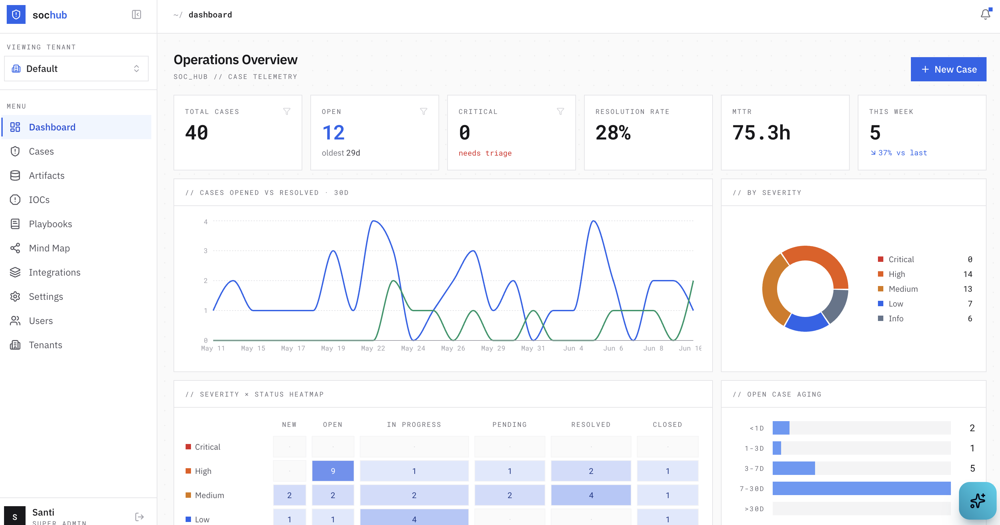

</div>

---

SOC Hub is an incident-response workbench for security teams. Analysts triage cases,
attach IOCs and artifacts, work IR playbooks, and visualize how indicators connect
cases — assisted by an AI copilot that runs entirely on a **local** model (no data
leaves your infrastructure) and proposes actions you explicitly approve.

## Highlights

- 🏢 **Multi-tenant** — one account, many tenants, a **role per tenant**; row-level isolation, in-app tenant switcher.
- 🤖 **Investigation Copilot** — a global, context-aware assistant (Ollama/local LLM). Chats about the case, and **proposes actions** (create case, add IOC, add timeline note, update status, correlate cases) that you confirm before anything is written. Proactively flags indicators it spots in conversation.
- 📋 **Playbooks** — a global **marketplace** of MITRE-mapped IR playbooks; tenants import the ones they want and auto-fill phase-grouped task checklists (Identification → Containment → Eradication → Recovery → Lessons Learned) onto cases.
- 📊 **Telemetry dashboard** — opened-vs-resolved trends, severity × status heatmap, open-case aging, MTTR, and top shared indicators.
- 🕸️ **Investigation graph** — interactive force-directed map of cases ◉, artifacts ▢, and IOCs ◇, with dashed **value-match bridges** that reveal cross-case correlation. Filter, zoom, drag, click for details.
- 🔐 **Security first** — per-tenant webhook keys, Argon2 password hashing, strong-`SECRET_KEY` enforcement, a password policy, security headers, and full audit logging.
- 🪪 **Per-tenant SAML SSO** — tenant admins configure their own IdP (Okta, Entra ID, Google…) with optional JIT provisioning.

## Screenshots

### 🕸️ Investigation graph — see how indicators connect cases

Cases ◉, artifacts ▢, and IOCs ◇ in one force-directed map; dashed amber bridges
reveal where the same indicator value appears across different cases. Filter, zoom,
drag, and click any node for a detail dossier.

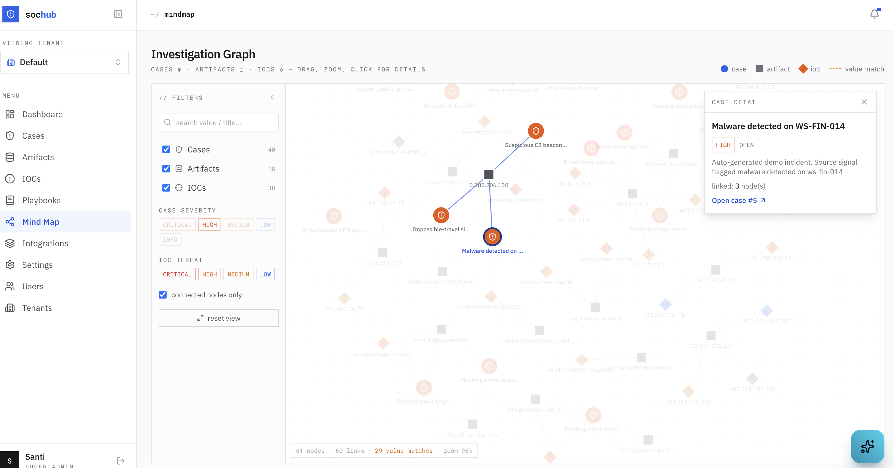

### 🤖 AI copilot — propose → confirm, nothing happens without your click

The copilot analyzes the case, suggests next steps, and proposes structured actions
(add IOC, record a note, update status). It also proactively flags indicators it
notices in conversation. You confirm before anything is written.

<table>
<tr>
<td width="50%">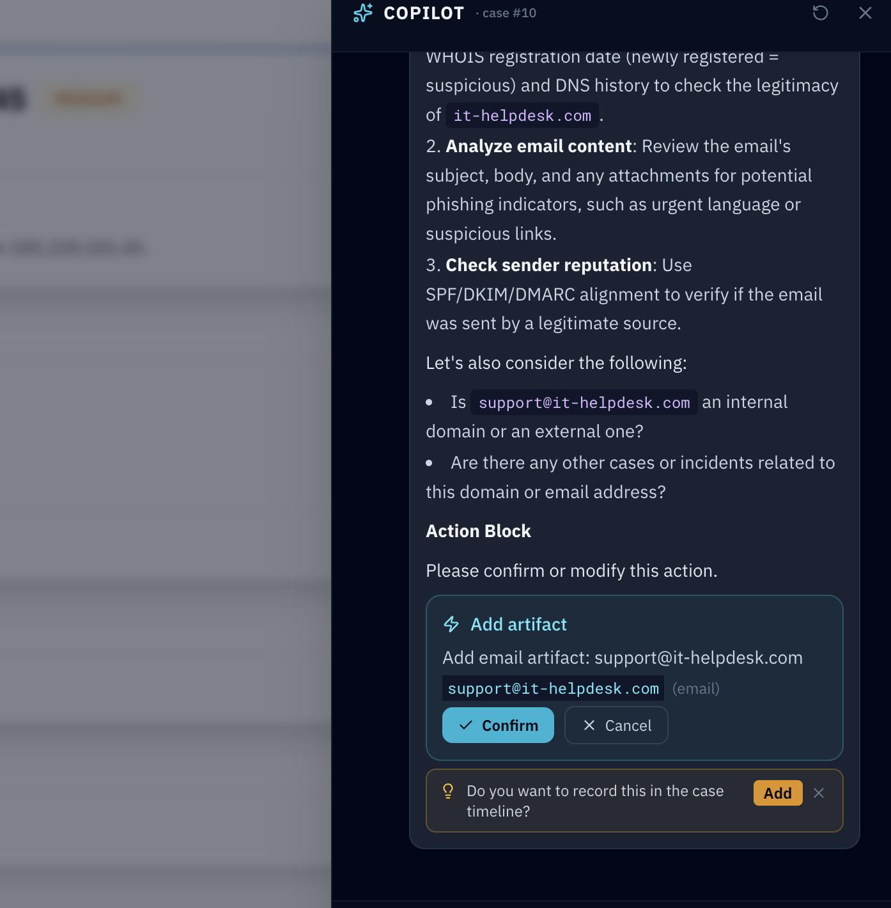</td>
<td width="50%">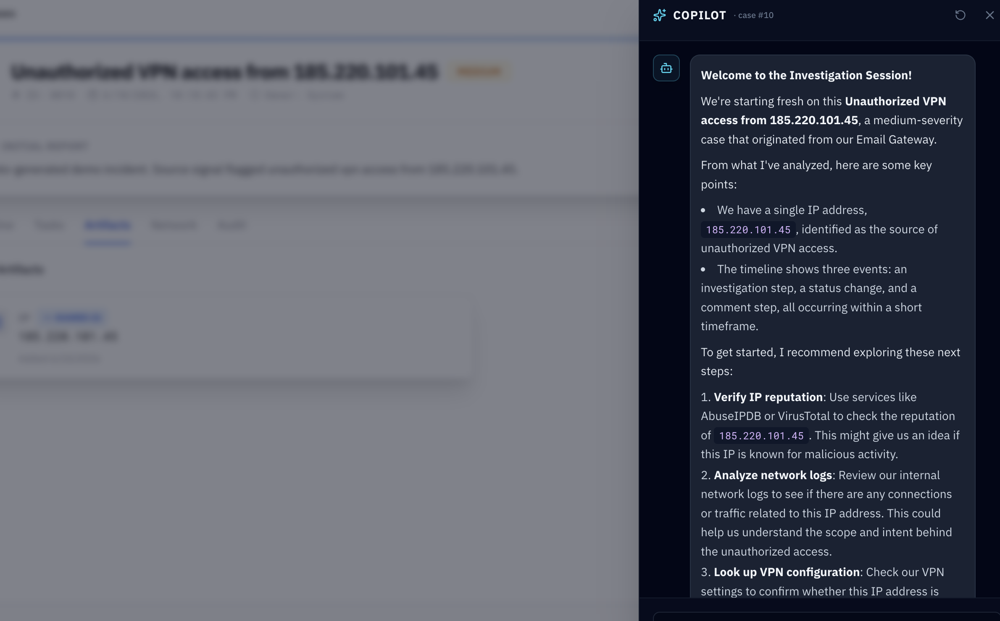</td>
</tr>
</table>

### 📋 Playbooks — import IR playbooks, auto-fill phase-grouped tasks

A marketplace of MITRE-mapped playbooks; applying one fills the case with a
phase-grouped task checklist and a progress tracker.

<table>
<tr>
<td width="50%">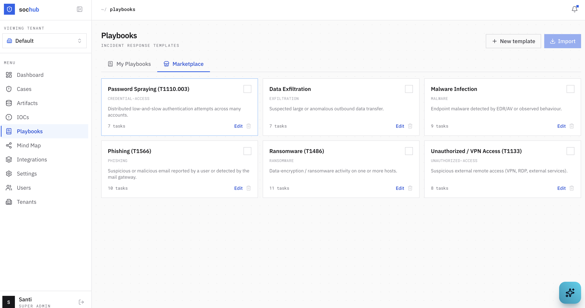</td>
<td width="50%">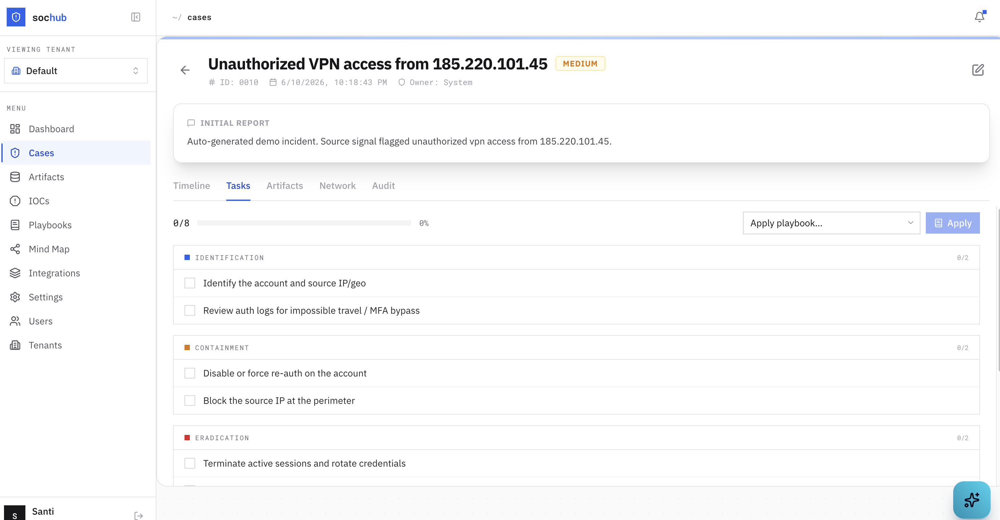</td>
</tr>
</table>

### 🗂️ Cases, IOCs & artifacts

<table>
<tr>
<td width="50%">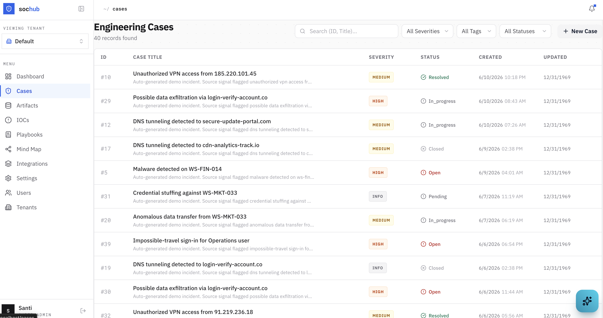</td>
<td width="50%">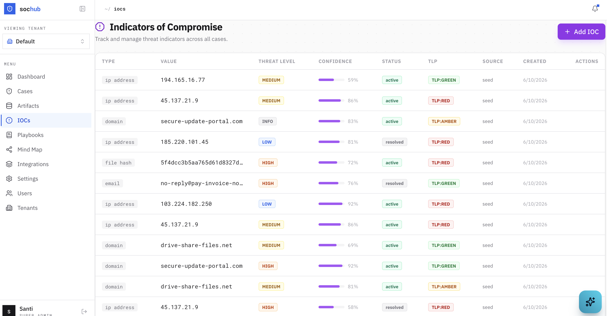</td>
</tr>
</table>

<details>
<summary><b>More screenshots</b></summary>

<br/>

**Case detail — timeline**

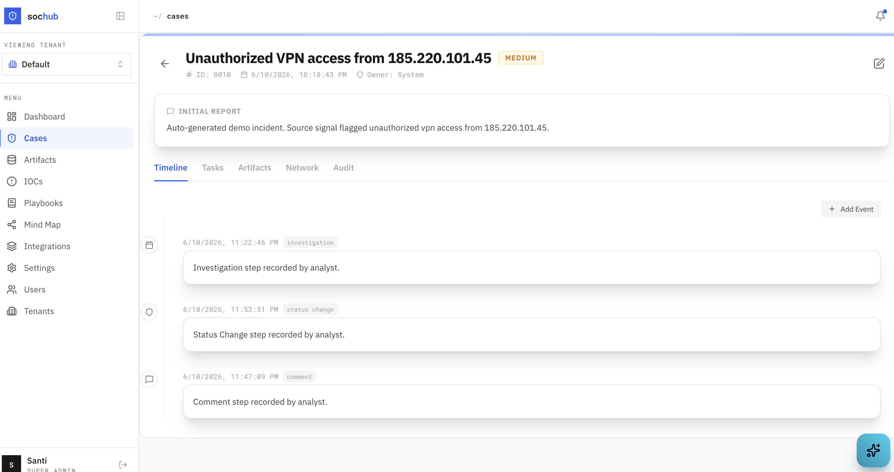

**Artifact repository — shared indicators across cases**

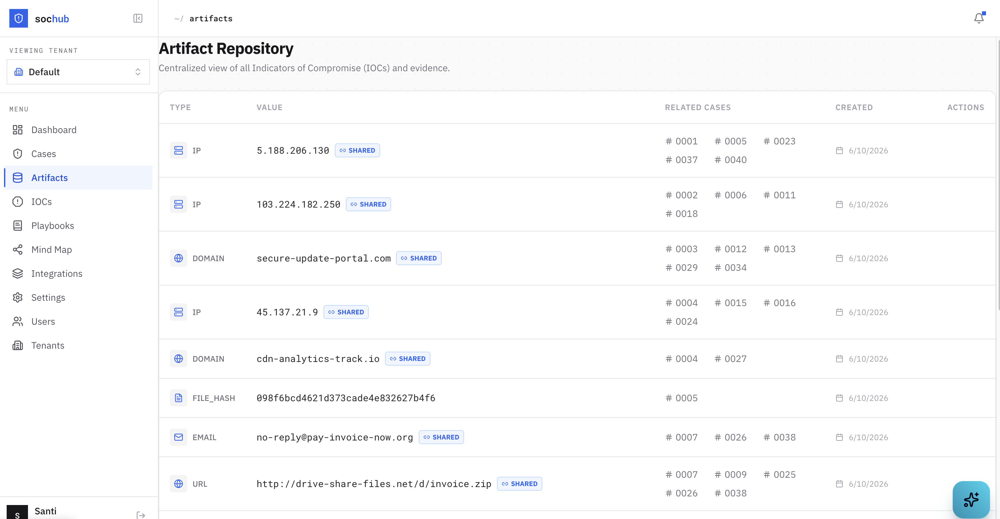

**Copilot — general (queue-level) assistant**

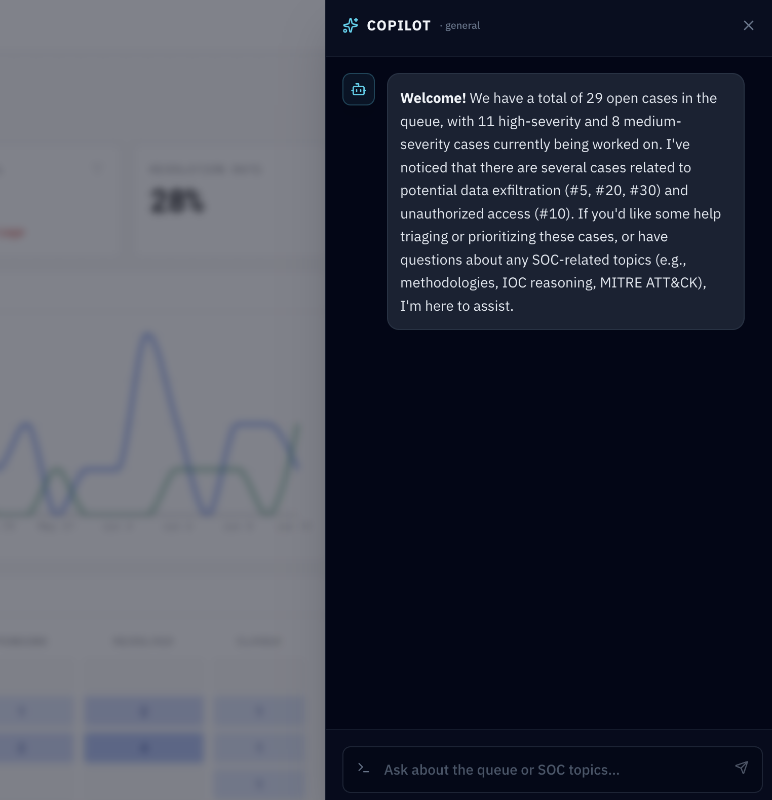

</details>

## Tech stack

| Layer | Technology |
|---|---|
| Backend | FastAPI · SQLAlchemy (async) · PostgreSQL (asyncpg) · Alembic |
| Frontend | React 19 · TypeScript · TanStack Query · React Router v7 · Tailwind CSS · Recharts |
| Auth | JWT (HS256) · Argon2 · per-tenant SAML SSO (python3-saml) |
| Background | Celery · Redis |
| AI | Ollama (local LLM, default `llama3`) |
| Infra | Docker Compose |

## Quick start

```bash
# 1. Bring up the full stack (db, redis, ollama, backend, worker, frontend)
docker compose up -d --build      # the ollama container auto-pulls the model on first boot

# 2. Apply database migrations
docker compose exec backend alembic upgrade head

# 3. Create the first super-admin (prompts securely for a password)
docker compose exec backend python -m app.scripts.create_super_admin \
  --email admin@example.com --name "Super Admin"
```

Then open **http://localhost** and sign in. For the full walkthrough (seeding demo
data, configuring SSO, etc.) see **[docs/getting-started.md](docs/getting-started.md)**.

> **Heads-up:** copy `backend/.env.example` → `backend/.env` and set a strong
> `SECRET_KEY` before exposing this anywhere. The app refuses to boot with a weak
> key unless `DEBUG=true`. The default Postgres credentials in `docker-compose.yml`
> are for **local development only**.

## Documentation

Full docs live in **[`docs/`](docs/README.md)**:

| Doc | What's in it |
|---|---|
| [Getting Started](docs/getting-started.md) | Setup, bootstrap, demo data, model pull |
| [Architecture](docs/architecture.md) | Components, data model, request flow |
| [Configuration](docs/configuration.md) | Environment variables, security knobs |
| [Features](docs/features.md) | Copilot, playbooks, dashboard, graph, multi-tenancy |
| [SAML SSO](docs/sso/saml-design.md) | Per-tenant single sign-on |
| [Design notes](docs/README.md#design-notes) | Per-subsystem design records |

## Status & license

Active development. This is a portfolio/reference implementation — review the
security posture and configuration before any production use. License: _to be
decided by the repository owner._
